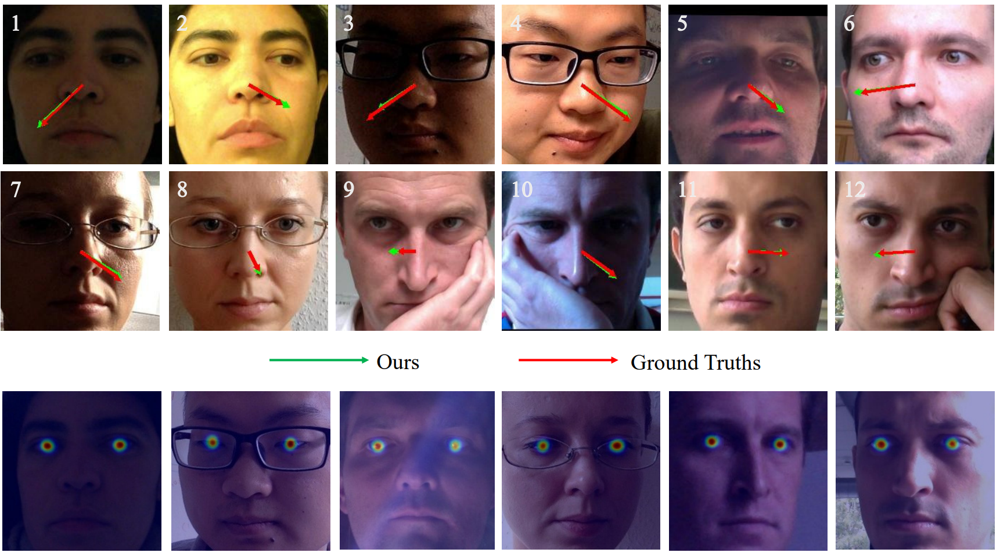

# Frequency-Spatial Interaction Network for Gaze Estimation

**The code will be open**

   

**Figure:**  *Visualization of gaze direction estimation under different conditions is displayed in the top two rows. The bottom row illustrates the results of eye region detection.*

## Requirement
* Python 3.8.0
* Pytorch 1.10.2
* CUDA 10.2

## Datasets
ETH-XGaze, GazeCapture, MPIIFaceGaze, and EyeDiap datasets are downloaded from their respective official websites.

The datasets are pre-processed using the method outlined in [1]. The code for data pre-processing is released by the authors of [1] and is available at [this page](https://phi-ai.buaa.edu.cn/Gazehub/).

## Reference
[1] Cheng Y, Wang H, Bao Y, et al. Appearance-based gaze estimation with deep learning: A review and benchmark[J]. IEEE Transactions on Pattern Analysis and Machine Intelligence, 2024.
